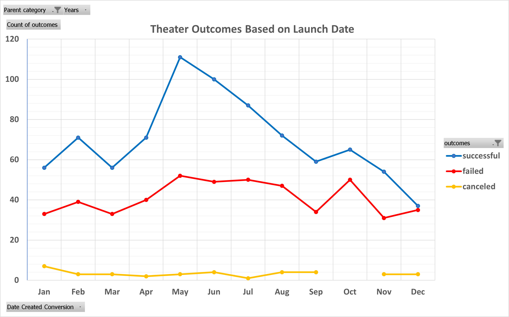
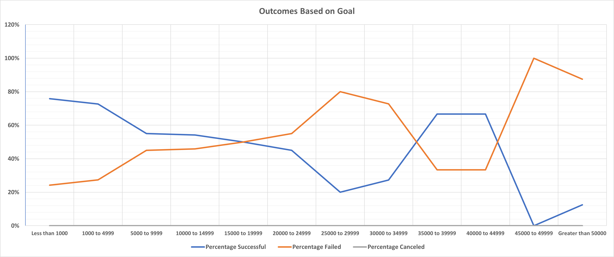

# Kickstarting with Excel
This project details what we have done to perform analysis on Kickstarter data to uncover trends.

## Table of contents
- [Overview of Project](#overview-of-project)
  - [Purpose](#purpose)
- [Analysis and Challenges](#analysis-and-challenges)
  - [Analysis of Outcomes Based on Launch Date](#analysis-of-outcomes-based-on-launch-date)
  - [Analysis of Outcomes Based on Goals](#analysis-of-outcomes-based-on-goals)
  - [Challenges and Difficulties Encountered](#challenges-and-difficulties-encountered)
- [Results](#results)

## Overview of Project
Module 1 assignment consists of two technical analysis deliverables and a written report to deliver our results. Our goals are to deliver the following deliverables, commit the results, including two required charts, and the report in a GitHub repository (repo) while helping to uncover trends in the Kickstarter data.
- ☑️ Deliverable 1: Outcomes Based on Launch Date Chart (Theater_Outcomes_vs_Launch.png)
- ☑️ Deliverable 2: Outcomes Based on Goals Chart (Outcomes_vs_Goals.png)
- ☑️ Deliverable 3: A written analysis of the results (this ["README.md"](./README.md))

All three deliverables in Module 1 challenge are committed in this GitHub repo called ***kickstarter-analysis*** as outlined below.  
main branch  
|&rarr; ./README.md  
|&rarr; ./01_kickstarter/  
  &nbsp; |&rarr; [./01_kickstarter/README.md](./README.md)  
  &nbsp; |&rarr; [./01_kickstarter/Kickstarter_Challenge.zip](./Kickstarter_Challenge.zip)  
  &nbsp; |&rarr; ./01_kickstarter/resources/  
    &emsp; |&rarr; [./01_kickstarter/resources/Theater_Outcomes_vs_Launch.png](./resources/Theater_Outcomes_vs_Launch.png)  
    &emsp; |&rarr; [./01_kickstarter/resources/Outcomes_vs_Goals.png](./resources/Outcomes_vs_Goals.png)  

### Purpose
By using some useful data analytics/visualization features in MS Excel 2016 and collaborative GitHub platform, we strived to:
- visualize campaign outcomes based on their launch dates and their funding goals.
- submit a written report based on our analysis and the visualizations we created, and help uncover trends of the Kickstarter data.

## Analysis and Challenges
These analyses were performed by applying Excel Pivot Table, Pivot Chart and other Chart types, Sort & Filter, and several built-in Excel functions (e.g. COUNTIFS, YEAR, DATE, DELTA). While I was comfortable working on the two technical analysis deliverables, I was facing a lot of challenges with the setup problems and familiarizing myself with the markdown language that is new to me. But, since I possess some html concepts, I could adjust quickly to the markdown language. Writing a markdown script is actually less stressful than that of writing a traditional html script.

### Analysis of Outcomes Based on Launch Date
The analysis results of Outcomes based on Launch Date for the Theater parent category is shown below.

**Fig. 1 Theater Outcomes Based on Launch Date**

### Analysis of Outcomes Based on Goals
The analysis results of Outcomes based on Goals for the plays subcategory is shown below.

**Fig. 2 Outcomes Based on Goals**

### Challenges and Difficulties Encountered
Downloading prerequisite softwares and cloning a git repo from GitLab was smooth because we were only required to `git pull` afterward. Here are three main struggles and how I overcame them.
1. Difficulty authenticating connection between my local machine (Git Bash, VS Code) to remote GitHub repos, so that I can synchronize my local and remote repos. I overcome it by:
>>💡 `ssh-add` and `ssh-add -l` for making sure an existing SSH key,\
>>💡 learning best practices from [GitHub Docs](https://docs.github.com/en) and 1-on-1 tutoring,\
>>💡 trial and error, and never-say-die mindsets.
2. Locale settings of MS Excel 2016, which automatically displayed months of _Date_ and _Short Date_ formatted cells as 1, 2, .., 12 instead of Jan, Feb, .., Dec. Pivot Table and Pivot Chart were all affected, which prevented me from aligning results with the assignment requirements. It took me a few days to finally figure it out.
>>💡 Preferred locale (language) can be changed via Power Query in MS Excel 2016.\
>>💡 During the process of getting back on track, I also applied some efficient techniques for reconfirming the accuracy of results, such as `Fill > Right`, `Fill < Left`, `DAYS()`, `DELTA()`, etc.
3. A few misleading descriptions and broken links in Module 1, for example line breaks in markdown language are not `---` hyphens. Line breaks in markdown should be two consecutive spaces, three consecutive spaces, or \\ (backslash) at the end of a line.

## Results
- Two conclusions we can draw about the Outcomes based on Launch Date:
  1. Successful outcomes in Theater category were pretty flat from January-April, peaked in the month of May, and decreased towards December. December was the only month when the number of Successful outcomes felt to -1.33% below the total number of Failed and Canceled projects combined. The rest of months had at least double-digit number of more successful outcomes compared to Failed and Canceled projects combined.
  2. May and June were the only periods when Kickstarter campaigns recorded successful outcomes by 30% or higher compared to the rest of months, and December was the least successful time for Theater category.

- Conclusions about the Outcomes based on Goals:
  1. Percentage alone is not a robust statistic. Percentage varies widely depending on the number of samples and total population of data, basically enumerator and denominator. It only lets us understand whether the Kickstarter campaigns have more Successful or Failed outcomes. The Kickstarter campaigns are more successful up to $15000 to $19999 goal range, likely to fail more after the 1st cross-point at $15000 to $19999 range and keeps fluctuating beyond at higher goal amounts.
  2. To visualize the success/fail rate, I think number of Successful, Failed, and Total projects are better metrics for the Kickstarter campaigns. Clustered column graphs are probably better for revealing trends of Outcomes based on Goals.

- Some limitations of this dataset are:
  1. Goal and Pledged data of Successful or Failed outcomes were extremely skewed datasets.
  2. Number of projects (either Successful or Failed) saturated after exceeding goals of $25000.
  3. Because number of Canceled outcomes was zero regardless of Goal data, no data analytics and visualization could be performed.
  
- Some other possible tables and/or graphs that we could create are clustered column graphs, histogram charts, and the corresponding descriptive statistics (see the summary table below). Based on the results, we can conclude that the Goal data are extremely skewed to the right for both Successful and Failed outcomes.  
**Table I**
  | Descriptive statistics | Successful outcomes | Failed outcomes |
  | :---                   | :---:               | :---:           |
  | Mean Goal              | $4,101              | $9,827          |
  | Median Goal            | $2,500              | $3,500          |
  | Mode Goal              | $2,000              | $5,000          |
  | Mean:Median Ratio      | ~ 1.64 (***right skewed***) | ~ 2.81 (***right skewed***) |
