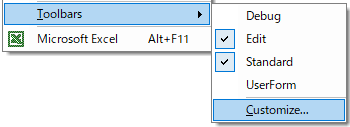
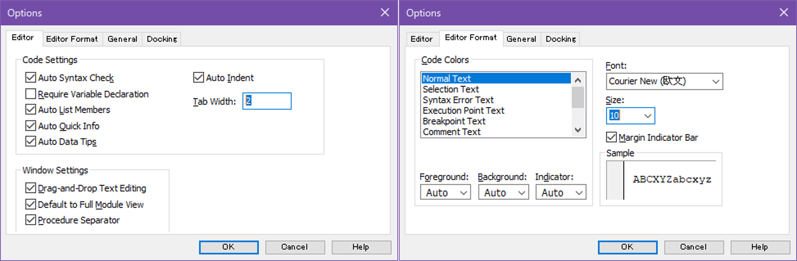

# An Analysis of Kickstarter Campaigns
This project details what we have done to perform analysis on Kickstarter data to uncover trends.

## Table of contents
[About me](#about-me)
[] [Lessons learned](#lessons-learned)
[] [Software](#software)
[] [Installation](#installation)
[] [First-time git setup](#first-time-git-setup)
[] [Create a repository](#create-a-repository)
[] [Clone a repository](#clone-a-repository)
[] [Update a repository](#update-a-repository)
[] [Module 1 challenge](#module-1-challenge)
[] [Module 2 challenge](#module-2-challenge)
[] [Acknowledgment](#acknowledgment)
[] [References](#references)

## About me
- 👋 Hi, there &smile;. My name is Parto Tandjoeng of [Micron Technology, Inc.](https://www.micron.com/).
- 🌱 I'm interested in knowing more about data analytics, data visualization, and Machine Learning. I’m currently trying my best to learn some popular tools, including collaborative tools, and best known methods that are widely used for data analytics and visualization.
- 👯 Although I'm still new to data analytics, data visualization and ML, this is the first step to move out of my comfort zone and learn new things every day from this intensive training and other cohorts. I’m looking forward to collaborating on some class work and assignments with my cohorts, extremely supportive TAs, and knowledgeable tutors.
- [[More about my personal reflection]](https://github.com/ats-tandjoeng7/kickstarter-analysis/blob/main/00_prework/Data_Analytics_Reflect_Activity.pdf)

## Lessons learned
This project also summarizes some of the tools that we have used during UCB Data Analytics Boot Camp, shares basic steps to connect our local git/SSH to GitHub/GitLab, clone/update repositories, and hopefully helps others overcome struggles that some of us have experienced during the process. It listed some best known methods and references, but some may still need a few little tweaks to create a suitable computer environment in certain cases.

## Software
Here is a list of some software prerequisites for UCB Data Analytics Boot Camp. Some cohorts may use additional tools and different settings to make them more effective and efficient.
- MS Excel 2016 version 2206 or newer
- VS Code version 1.70.2 or newer
- Anaconda3
- Git version 2.37.2.windows.2 or newer
- GitHub
- GitLab

## Installation
First-time user will be responsible for navigating the official sites of each software source, installing ones that they need to their local machine, and signing up for an account of some popular online collaboration tools. Free version for students, open-source contributors, and individuals generally suffices the course requirements. Below are some useful download pages.
- [MS Excel 2016](https://www.microsoft.com/en-us/microsoft-365/try)
- [VS Code](https://visualstudio.microsoft.com/downloads/)
- [Anaconda3](https://www.anaconda.com/products/distribution)
- [Git](https://git-scm.com/downloads)
- [GitHub](https://github.com/)
- [GitLab](https://ucb.bootcampcontent.com/users/sign_in)

## First-time git setup
Authentication steps are required when we first connect our local machine to GitHub/GitLab. Examples and descriptions are mainly given by assuming git and SSH are being utilized. Experienced users may safely skip this process.

### Generate new SSH key
On Git Bash/Terminal, we can check for existing SSH keys by `ssh-add -l` or `ssh-add -L`. If we do not have one or want to recreate a SSH key, the following command lines create a new SSH key in our local machine. For more info, refer to [Connecting to GitHub with SSH](https://docs.github.com/en/authentication/connecting-to-github-with-ssh).
```
ssh-keygen -t ed25519 -C "your email or file path"
eval `ssh-agent -s`
ssh-add ~/.ssh/id_ed25519
clip < ~/.ssh/id_ed25519.pub
```
```
ssh-keygen -t -rsa -b 4096 -C "your email or file path"
eval `ssh-agent -s`
ssh-add ~/.ssh/id_rsa
clip < ~/.ssh/id_rsa.pub
```
💡 PS: `pbcopy` and `pbpaste` on Macs are equivalent to `clip` (copy) and `powershell -command get-clipboard` (paste) commands on Windows.

### Add SSH key to GitHub/GitLab
Next, go to GitHub and GitLab website to register our SSH key.
- Log on to [GitHub](https://github.com/) account and click **Profile** &rarr; **Settings** &rarr; **SSH and GPG keys** &rarr; **New SSH key** &rarr; select _Authentication Key_ as **Key type** &rarr; type in **Title** &rarr; paste the clipboard containing our public SSH key under **Key** &rarr; click **Add SSH key**.
- Log on to [GitLab](https://ucb.bootcampcontent.com/users/sign_in) account and click **Edit profile** &rarr; **SSH Keys** &rarr; paste the clipboard containing our public SSH key under **Key** &rarr; type in **Title** &rarr; choose **Expiration date** &rarr; click **Add key**.

### GitHub authentication by PAT
GitHub also requires a PAT (personal access token) to allow GIT operations ([Token authentication requirements for Git operations](https://github.blog/2020-12-15-token-authentication-requirements-for-git-operations/)).\
Log on to [GitHub](https://github.com/) account and click **Profile** &rarr; **Settings** &rarr; **Developer settings** &rarr; **Personal access tokens** &rarr; **Generate new token** &rarr; copy the token &rarr; on Git Bash/Terminal run `git config --global user.name`, `git config --global user.password`, or `git config --global user.email` command lines and paste the token as user.password.
```
git config --global user.name your_github_username
git config --global user.password your_github_token
```

### Verify successful authentication
If `ssh -T git@github.com` command line on Git Bash/Terminal displays this: "Hi _your_username_! You've successfully authenticated, but GitHub does not provide shell access.", then our first-time git setup should work fine.
```
ssh -T git@github.com
```

## Create a repository
Here are some basic steps to create a repository (repo) in our GitHub account.
- Log on to [GitHub](https://github.com/) account and click the pull down menu next to ➕ at the top-right &rarr; **New repository** &rarr; type in a name under **Repository name** &rarr; type in succint description about the repo/project under **Description** &rarr; select _Public_ &rarr; ☑️ check **Add a README file** &rarr; click **Create repository**.

## Clone a repository
Here are some basic steps to clone an existing repo from GitHub/GitLab.
- Log on to [GitHub](https://github.com/) account and click **Profile** &rarr; **Your repositories** &rarr; click a project/repo you want to clone &rarr; **Code** &rarr; select _SSH_ &rarr; click the copy url next to the repo link &rarr; paste the clipboard containing our repo url after `git clone "repo url"`.
```
cd path_we_want_repo_to_reside
git clone git@github.com:your_username/your_repo_name.git
```
- Log on to [GitLab](https://ucb.bootcampcontent.com/users/sign_in) account and click a project/repo you want to clone &rarr; **Clone** &rarr; **Clone with SSH** &rarr; click **Copy URL** next to the repo link &rarr; paste the clipboard containing our repo url after `git clone "repo url"`.
```
cd path_we_want_repo_to_reside
git clone git@ucb.bootcampcontent.com:UCB-Coding-Bootcamp/UCB-VIRT-DATA-PT-08-2022-U-B.git
```

## Update a repository
We use `git pull` or `git push` command on Git Bash/Terminal to update a repo, but it is recommended to make a backup of local repo before doing so because such operation may overwrite our ongoing changes.

If `git status` command gives something like "On branch main .. Your branch is up to date with 'origin/main'. nothing to commit, working tree clean," this usually means it is unnecessary to run `git pull` or `git push` command because there will be nothing to pull to our local repo or push to our remote repo. It is also recommended to run `git pull` once in case we make a change on the GitHub website before making and/or pushing any new changes from your local repo.

### `git pull`
```
cd existing_repo_name
git status
git pull
```

### `git push`
```
cd existing_repo_name
git status
git remote add origin https://ucb.bootcampcontent.com/UCB-Coding-Bootcamp/UCB-VIRT-DATA-PT-08-2022-U-B.git
git branch -M main
git push -uf origin main
```

### `git push` new or modified file/folder
```
cd existing_repo_name
git add .
git commit -m "commit files and folders"
git push origin main
```
[//]: # (Or better with -u or --set-upstream flag, like git push -u origin main, though we only need to do this once for that association to be recorded in .git/config.)

## Module 1 challenge
All deliverables in Module 1 challenge are committed in a GitHub repo as outlined below. For detailed report, see ["README.md."](./01_kickstarter/README.md)  
main branch  
|&rarr; ./README.md  
|&rarr; ./01_kickstarter/  
  &nbsp; |&rarr; ./01_kickstarter/README.md  
  &nbsp; |&rarr; ./01_kickstarter/Kickstarter_Challenge.zip  
  &nbsp; |&rarr; ./01_kickstarter/resources/  
    &emsp; |&rarr; ./01_kickstarter/resources/Theater_Outcomes_vs_Launch.png  
    &emsp; |&rarr; ./01_kickstarter/resources/Outcomes_vs_Goals.png  

## Module 2 challenge
All deliverables in Module 2 challenge are committed in a GitHub repo as outlined below. For detailed report, see ["README.md."](https://github.com/ats-tandjoeng7/stock-analysis/blob/main/README.md)  
main branch  
|&rarr; ./README.md  
|&rarr; ./02_wall-street/  
  &nbsp; |&rarr; ./02_wall-street/VBA_Challenge.vbs  
  &nbsp; |&rarr; ./02_wall-street/VBA_Challenge.xlsm  
  &nbsp; |&rarr; ./02_wall-street/resources/  
    &emsp; |&rarr; ./02_wall-street/resources/VBA_Challenge_2017.png  
    &emsp; |&rarr; ./02_wall-street/resources/VBA_Challenge_2018.png  
    &emsp; |&rarr; ./02_wall-street/resources/VBA_Runtime_Performance_Analysis.png  

### MS Excel VBA setup
Some useful toolbars such as `Debug` and `Edit` toolbars, and setting options available in the Excel VBA Editor may be customized for boosting our productivity in coding VBA (Visual Basic for Applications) programs. Here are a few features that some of us used during Module 2 class work and assignment.

\
**Fig. 1 Customized VBA Editor Toolbars**

\
**Fig. 2 Customized VBA Tools' Options**

## Acknowledgment
- TAs: Austin Sloane, Nick Sneed
- Tutors: Saad Khan, Nelson Tsai

## References
### GitHub and Markdown
[Connecting to GitHub with SSH](https://docs.github.com/en/authentication/connecting-to-github-with-ssh)\
[Token authentication requirements for Git operations](https://github.blog/2020-12-15-token-authentication-requirements-for-git-operations/)\
[git push origin main vs git push -u origin main](https://stackoverflow.com/questions/5697750/what-exactly-does-the-u-do-git-push-u-origin-master-vs-git-push-origin-ma)\
[Basic writing and formatting syntax](https://docs.github.com/en/get-started/writing-on-github/getting-started-with-writing-and-formatting-on-github/basic-writing-and-formatting-syntax)\
[emoji-cheat-sheet](https://github.com/ikatyang/emoji-cheat-sheet/blob/master/README.md)

### MS Excel VBA
[Excel VBA Reference](https://docs.microsoft.com/en-us/office/vba/api/overview/excel)
